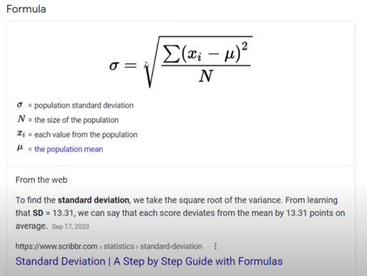
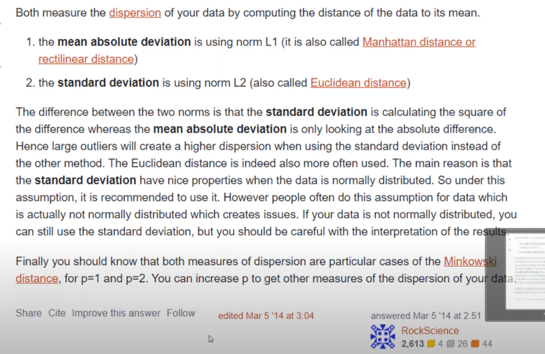
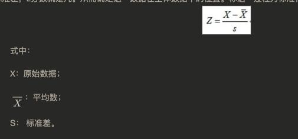

machine learning
- why取对数
  - 1.缩小数据之间的绝对差异，避免个别极端值的影响 
  - 2 尽可能满足经典线性模型假定(classic linear model)
    - 避免共线性
    - 避免异方差，满足同方差基本假定
    - 尽可能符合正态分布

- 对数变换(log transformation)
    - 对数据做一些变换的目的是它能够让它符合我们所做的假设，使得我们能够在已有理论上对其分析
对数变换是特殊的数据变换方式，它可以将一类我们理论上未解决的模型问题转化为依据解决的问题。
这里说两类有代表性的模型：[链接](https://www.zhihu.com/question/22012482)
    - 理论上：随着自变量的增加，因变量的方差也增大的模型
         模型：分布的标准差与其均值线性相关

    - 经验上：研究数据的增长率分布存在一定规律的模型

  通的数据变换方式坚持正态性假设，通过各种数据转换函数将非正态数据转换为正态，常用的变换方式有以下几种：\
（1）对数变换；\
（2）平方根变换；\
（3）倒数变换；\
（4）平方根后取倒数；\
（5）平方根后再取反正弦；\
（6）幂变换；

>box-cox变换\
> box-cox变换的目标有两个：
> 一个是变换后，可以一定程度上减小不可观测的误差和预测变量的相关性。主要操作是对因变量转换，使得变换后的因变量于回归自变量具有线性相依关系，误差也服从正态分布，误差各分量是等方差且相互独立。
> 第二个是用这个变换来使得因变量获得一些性质，比如在时间序列分析中的平稳性，或者使得因变量分布为正态分布。

#### 标准差 和 平均绝对偏差
[说明](https://www.statology.org/mean-absolute-deviation-vs-standard-deviation/)

## normal distribution and z score 
正态分布和z score 也叫标准分数（standard score）
  z分数（z-score），也叫标准分数（standard score）是一个数与平均数的差再除以标准差的过程。在统计学中，标准分数是一个观测或数据点的值高于被观测值或测量值的平均值的标准偏差的符号数。\
  z分数可以回答这样一个问题："一个给定分数距离平均数多少个标准差?"在平均数之上的分数会得到一个正的标准分数，在平均数之下的分数会得到一个负的标准分数。 z分数是一种可以看出某分数在分布中相对位置的方法。

